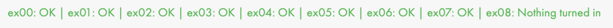
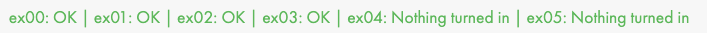
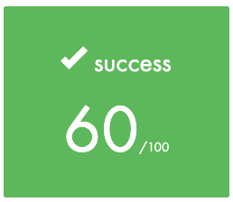

<h1 align="center">Piscine 42</h1>

Épreuve de sélection de l'école [42 Lyon Auvergne-Rhône-Alpes](https://42lyon.fr/) nommée "la Piscine" qui consiste à résoudre de nombreux exercices de programmation en Shell et en language C.

Mon temps total de connexion durant cette piscine a dépassé les 360h.

J'ai fini au niveau 9.65.

L'ensemble de ces exercices ont été réalisés durant le mois d'aout 2021.

Ce dépôt a pour unique but de montrer mon évolution en language C depuis mes débuts à 42.

L'ensemble de mes rendus sont tels que je les ai rendus durant la Piscine avec toutes les erreurs et imperfections possibles.

<h3 align="center">⚠️ Clause de non-responsabilité ⚠️</h1>

Si vous êtes entrain de passer la Piscine et qu'il vous viendrait à l'idée de copier mes réponses, sachez que vous avez de fortes chances de vous faire **arracher la tête** par le Bocal de votre campus et de ne pas être séléctionné.

---

### [Shell 00](./shell00/)

Début de la piscine par du Shell !

Quelques difficultés sur `diff` car cela me semblait trop simple puis sur `ft_magic` mais je l'ai quand même passé après un retry.

| |
| --- |
|  |

| | |
| --- | --- |
| Moulinette |  |
| Correcteur 1 |  |
| Correcteur 2 |  |

---
 
### [Shell 01](./shell01/)

J'ai plutôt bien aimé ce day, `MaRViN` était drôle, par contre je n'ai pas fait `add_chelou.sh` car je métrise mal le verlan.

| |
| --- |
|  |

| | |
| --- | --- |
| Moulinette |  |
| Correcteur 1 |  |
| Correcteur 2 |  |

--- 

### [C 00](./c00/)

Premiers excercices en C, je n'ai pas trop aimé les `ft_print_comb`, c'est pourquoi j'ai décidé de ne pas faire le dernier.

| |
| --- |
|  |

| | |
| --- | --- |
| Moulinette |  |
| Correcteur 1 |  |
| Correcteur 2 |  |

--- 

### [C 01](./c01/)

Introduction des pointeurs ! J'ai bien aimé !

| |
| --- |
|  |

| | |
| --- | --- |
| Moulinette |  |
| Correcteur 1 |  |
| Correcteur 2 |  |

--- 

### [C 02](./c02/)

Une des grosse difficulté de ce day est de faire la différence entre `ft_strcpy`, `ft_strncpy` et `ft_strlcpy`, puis de l'expliquer à tous ceux qui en avaient besoin.

Je n'ai pas fait `ft_print_memory` même si ce dernier est utile pour la suite.

| |
| --- |
|  |

| | |
| --- | --- |
| Moulinette |  |
| Correcteur 1 |  |
| Correcteur 2 |  |

--- 

### [C 03](./c03/)

Traitement de chaines de caractères principalement.

Pas de difficulté majeur sauf peut-être `ft_strstr` mais se résout avec un peu de réflexion.

| |
| --- |
|  |

| | |
| --- | --- |
| Moulinette |  |
| Correcteur 1 |  |
| Correcteur 2 |  |

--- 

### [C 04](./c04/)

Il est question ici de conversion de nombre avec le fameux `ft_atoi`, qui a fait peur à tant de monde ! 

Mes correcteurs m'ont validés `ft_putnbr_base` alors que la Moulinette non.

J'aurais pu faire le dernier `ft_atoi_base` mais encore une fois, j'ai préféré avancer.

| |
| --- |
|  |

| | |
| --- | --- |
| Moulinette |  |
| Correcteur 1 |  |
| Correcteur 2 |  |

--- 

### [C 05](./c05/)

Un peu de mathématiques dans ce day, c'était pas mon péféré, même si j'ai bien aimé `ft_fibonacci` et `ft_is_prime` et `ft_find_next_prime`.

Je n'ai pas fait le dernier exercice nommé "Les dix dames", car je suis très mauvais aux échecs.

| |
| --- |
|  |

| | |
| --- | --- |
| Moulinette |  |
| Correcteur 1 |  |
| Correcteur 2 |  |

--- 

### [C 06](./c06/)

Introduction aux paramètres, j'ai beaucoup aimé !

| |
| --- |
|  |

| | |
| --- | --- |
| Moulinette |  |
| Correcteur 1 |  |
| Correcteur 2 |  |

--- 

### [C 07](./c07/)

Introduction à `malloc` !

Très intéréssant, par contre `ft_convert_base` et `ft_split` semblait difficile à ce moment de la piscine, donc j'ai préféré les sauter.

| |
| --- |
|  |

| | |
| --- | --- |
| Moulinette |  |
| Correcteur 1 |  |
| Correcteur 2 |  |

--- 

### [C 08](./c08/)

Introduction aux fichiers d'en-tête (header).

| |
| --- |
|  |

| | |
| --- | --- |
| Moulinette |  |
| Correcteur 1 |  |
| Correcteur 2 |  |

--- 

### [C 09](./c09/)

Introduction à `Make` et aux fichiers `Makefile` ainsi qu'à la création de librairie.

| |
| --- |
|  |

| | |
| --- | --- |
| Moulinette |  |
| Correcteur 1 |  |
| Correcteur 2 |  |

--- 

### [C 10](./c10/)

Je n'ai pas fait ce day car il semblait **vraiement** pas simple et que le day suivant était plus important à voir.

| |
| --- |
|  |

--- 

### [C 11](./c11/)

Introduction aux pointeurs de fonctions, sujet très intéréssant.

Mes correcteurs m'ont validés l'excercice 05 alors que la Moulinette me l'a refusée.

C'était mon dernier day de piscine.

| |
| --- |
|  |

| | |
| --- | --- |
| Moulinette |  |
| Correcteur 1 |  |
| Correcteur 2 |  |

--- 

### [C 12](./c12/)

Introduction aux listes chainées, je n'ai fait aucun excercice de ce day.

| |
| --- |
|  |

| | |
| --- | --- |
| Moulinette |  |
| Correcteur 1 |  |
| Correcteur 2 |  |

--- 

### [C 13](./c13/) :

Introduction aux arbres binaires, je n'ai fait aucun excercice de ce day.

| |
| --- |
|  |

---

### [Rush 00](./rush00/)

Premier rush de la piscine, très simple, aucun problème à signaler.

| |
| --- |
|  |

| | |
| --- | --- |
| Correcteur 1 |  |

--- 

### [Rush 01](./rush01/)

Deuxième rush, là j'ai eu beaucoup de mal avec mon groupe à trouver le bon algorithme pour résoudre le problème. 

| |
| --- |
|  |

| | |
| --- | --- |
| Correcteur 1 |  |

--- 

### [Rush 02](./rush02/)

Dernier rush, il ne nous a pas manqué grand chose avec mon groupe pour le réussir, sans doute 4h de plus.

| |
| --- |
|  |

| | |
| --- | --- |
| Correcteur 1 |  |

--- 

### [BSQ](./bsq/)

Il manquait un saut de ligne pour valider ce projet, accepter cet échec fût difficile, surtout pour si peu.

| |
| --- |
|  |

| | |
| --- | --- |
| Correcteur 1 |  |
| Correcteur 2 |  |
| Correcteur 3 |  |

--- 

### Exam 00

Je me suis arrêté sur `strcmp`, je devais recoder cette fonction mais j'ai mal compris son fonctionnement. 

| |
| --- |
|  |

### Exam 01

Je me suis arrêté sur `atoi`, j'ai eu du mal à gérer les négatifs.

| |
| --- |
|  |

### Exam 02

Je ne suis pas arrivé à passer `itoa`.

| |
| --- |
|  |

### Exam final

Même chose qu'à l'exam précédent, j'ai buté sur `itoa`.

| |
| --- |
|  |